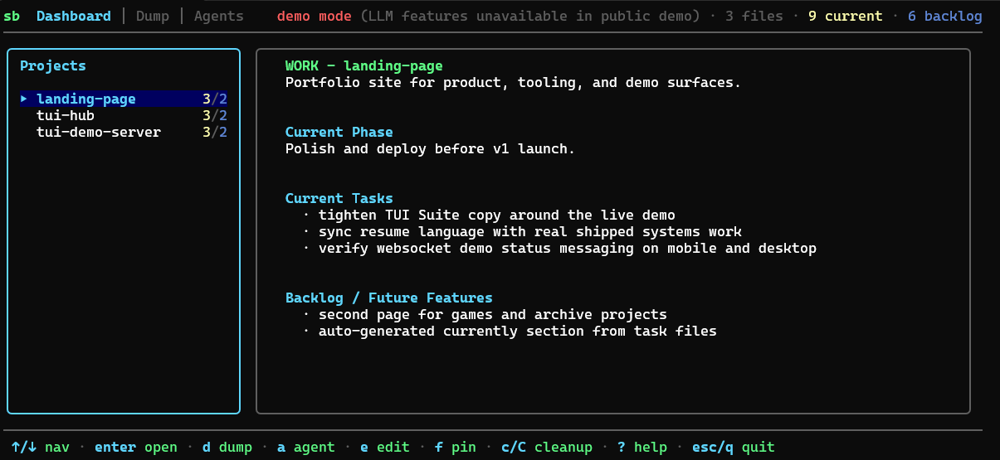
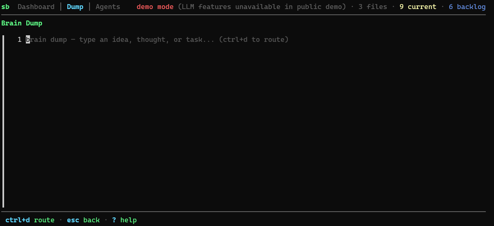
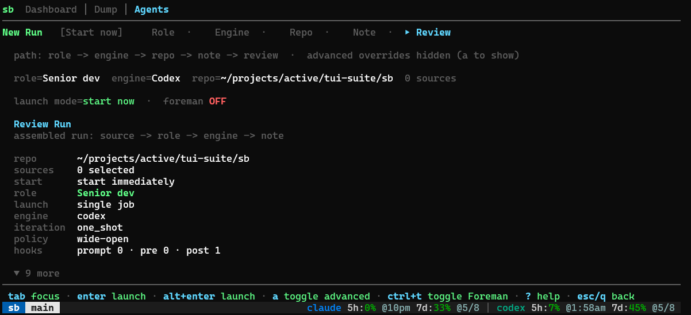

# sb

`sb` is a terminal control plane for `WORK.md`-style project management. It is built around cleaning task files up, routing rough thoughts into the right project, and launching agent-backed work from the same workspace.



**Live demo:** [froesch.dev](https://froesch.dev)

## Release Status

Developed for WSL2/Linux first. Cross-platform testing and bug fixing for macOS and native Windows are still in progress.

For now, use `sb` on WSL2, Linux, or macOS. Native Windows is not supported for this app yet.

## Install

Quick install:

```bash
curl -fsSL https://raw.githubusercontent.com/LFroesch/sb/main/install.sh | bash
```

Direct installer: [`install.sh`](https://raw.githubusercontent.com/LFroesch/sb/main/install.sh)

Or install with Go:

```bash
go install github.com/LFroesch/sb@latest
go install github.com/LFroesch/sb/cmd/foreman@latest
```

Run:

```bash
sb
sb --version
sb tmux-status
```

## Media





## Main Jobs

| Area | Purpose |
|------|---------|
| Dashboard | Browse discovered task files, clean them up, and jump into other flows |
| Dump | Turn a rough brain dump into routed task bullets |
| Agents | Start task-backed or freeform coding-agent runs |

If `tmux` is available, `sb` uses a shared cockpit session for the richer agent workflow. Without `tmux`, the TUI still works, but the agent flow is more limited.

## Features

- Discover and browse `WORK.md`-style task files across multiple roots
- Normalize task files into a consistent active-work format
- Route rough brain dumps into the right project and section
- Edit task files inline without leaving the app
- Launch freeform or task-backed agent runs from the same workspace
- Keep logs and workflow state under one terminal control plane

## Canonical Task File Shape

```md
# WORK - <name>
one-line summary

## Current Phase
single plain-text line

## Current Tasks
- active work only

## Backlog / Future Features
- not-now work
```

The important rules are simple:

- task files are for active work only
- shipped history belongs in `DEVLOG.md`
- cleanup rewrites files into the canonical shape instead of preserving ad hoc sections

## Useful Commands

```bash
sb
sb tmux-status
sb audit-taskfiles
```

## Config

Config is read from `~/.config/sb/config.json`.

Common fields:

- `scan_roots`
- `file_patterns`
- `explicit_paths`
- `idea_dirs`
- `catchall_target`
- `ideas_target`
- `provider` and `providers`

## Controls

| Key | Action |
|-----|--------|
| `j/k`, `up/down` | Move |
| `enter` | Open selected project or continue in the current flow |
| `e` | Edit the current `WORK.md` inline |
| `c` | Cleanup current project |
| `C` | Chain cleanup for selected or queued projects |
| `d` | Open brain-dump routing |
| `a` | Open Agents |
| `/` | Search across discovered task files |
| `r` | Refresh project scan |
| `,` | Open config directory |
| `?` | Help |
| `q`, `esc` | Back or quit depending on view |

## Notes

- logs are written under your user data dir, usually `~/.local/share/sb/logs/`
- repo-local workflow rules for a checkout can live in `AGENTS.md`

## License

[AGPL-3.0](LICENSE)
